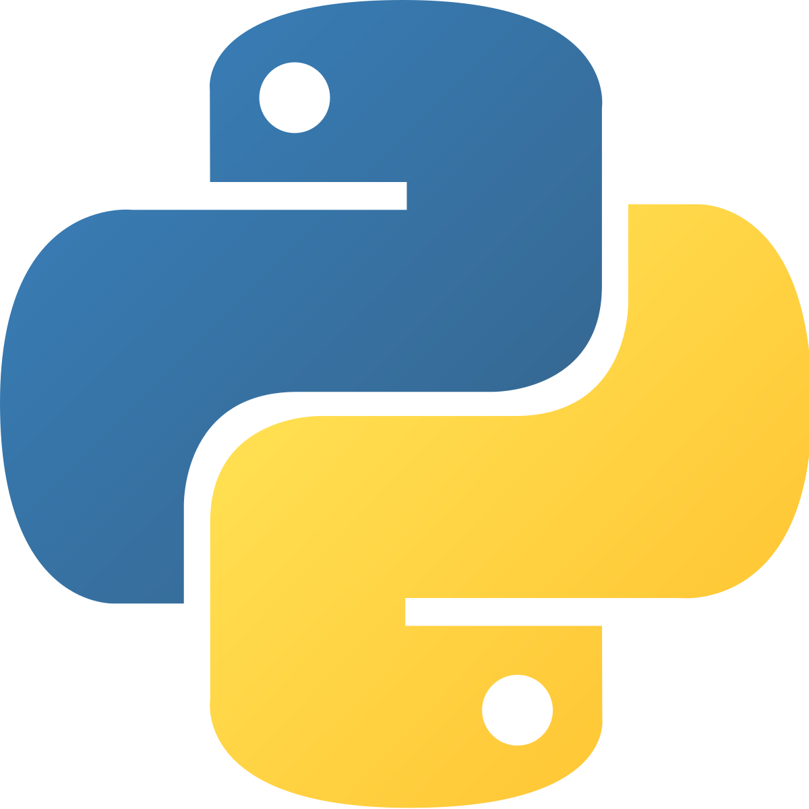

[![Contributors][contributors-shield]][contributors-url]
[![Forks][forks-shield]][forks-url]
[![Stargazers][stars-shield]][stars-url]

# Sudoku-Solver

A script written in Python that solves any given Sudoku board represented by a nine by nine 2-dimensional array with the integers 0-9 representing the numbers on a Sudoku board or the absence of a number (0), if there is a solution to it. Uses the Recursive Backtracking search algorithm, in a way similar to Brute Force.

<!-- BUILT WITH -->
### Built With

 - Python 3
 - Backtracking Algorithm

## Installation Instructions
You can download or modify the program by Cloning or Downloading the project or by saving it as a ".zip" file.
Once the downloaded file is extracted into a separate folder, follow these instructions:

### Python Setup
1. Install Python 3.x or latest version.

## Running
### Before running
1. Edit `main.py`
2. Go to line 3
3. Modify `board` to the deisred sudoku board represented by a 2-d array
### Instructions
1. Run main.py (located at the project root).

[contributors-shield]: https://img.shields.io/github/contributors/Kaweees/Sudoku-Solver.svg?style=for-the-badge
[contributors-url]: https://github.com/Kaweees/Sudoku-Solver/graphs/contributors
[forks-shield]: https://img.shields.io/github/forks/Kaweees/Sudoku-Solver.svg?style=for-the-badge
[forks-url]: https://github.com/Kaweees/Sudoku-Solver/network/members
[stars-shield]: https://img.shields.io/github/stars/Kaweees/Sudoku-Solver.svg?style=for-the-badge
[stars-url]: https://github.com/Kaweees/Sudoku-Solver/stargazers
